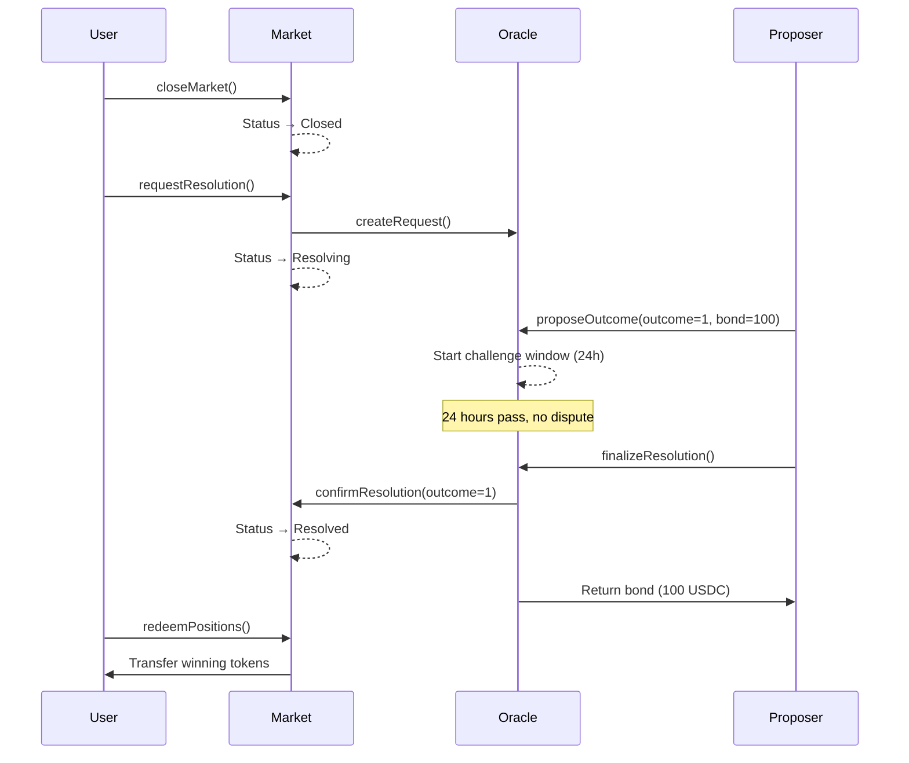
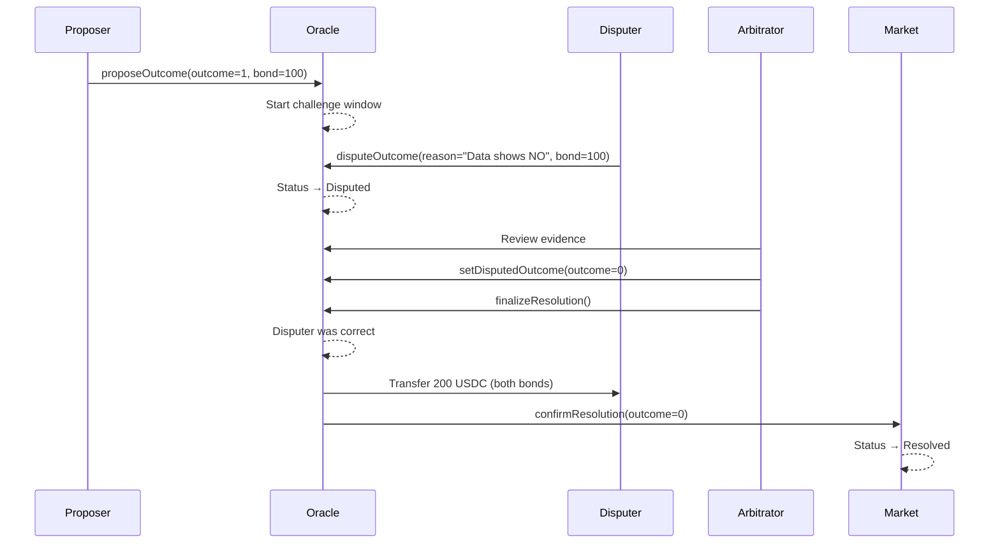
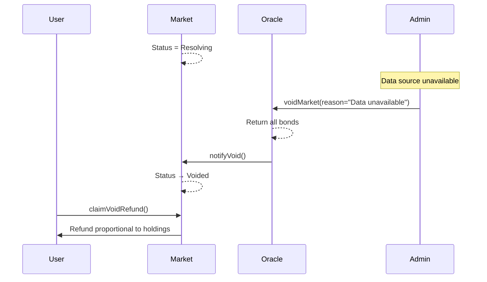

# Oracle Resolution System

## 概述

本系统实现了类似 Polymarket 的 **Optimistic Oracle 解决方案**，确保预测市场的结算权威性和去中心化。

## 核心设计原则

参考 Polymarket 和 UMA Protocol 的实现，我们的 Oracle 系统基于以下原则：

1. **Optimistic Assumption**: 默认提议是正确的，除非被挑战
2. **Economic Security**: 通过押金和激励机制防止恶意行为
3. **Challenge Period**: 给予充分时间让社区验证和挑战
4. **Finality**: 一旦确定，结果不可更改

## 市场状态机

```
Open → Closed → Resolving → Resolved / Voided
  ↓                ↓           ↑
Trading        Challenge    Final
Allowed        Window      Result
```

### 状态说明

| 状态 | 描述 | 允许的操作 |
|------|------|-----------|
| **Open** | 市场开放交易 | 买入/卖出 YES/NO tokens |
| **Closed** | 交易停止，等待解决 | 请求 Oracle 解析 |
| **Resolving** | Oracle 正在处理（Proposed/Disputed） | 提议结果、挑战、仲裁 |
| **Resolved** | 最终结果确定 | 赎回 winning tokens |
| **Voided** | 市场作废 | 按比例退款 |

## Optimistic Oracle 工作流程

### 1. Request（请求解析）

当市场到达 resolutionTime 后，任何人可以请求解析：

```solidity
function requestResolution(
    bytes32 conditionId,
    string question,
    string resolutionSource
)
```

**触发条件：**
- 市场状态 = Closed
- block.timestamp >= resolutionTime

**结果：**
- 创建 Oracle request
- 市场状态 → Resolving

### 2. Propose（提议结果）

白名单 proposer 或任何持有足够 bond 的地址可以提议结果：

```solidity
function proposeOutcome(
    bytes32 conditionId,
    uint256 outcome  // 0=NO, 1=YES, 2=INVALID
)
```

**要求：**
- 缴纳 `proposeBond`（如 100 USDC）
- 如果启用白名单，必须是 whitelisted proposer

**结果：**
- 记录提议的 outcome
- 开始 `challengeWindow`（如 24 小时）
- Proposer bond 被锁定

### 3. Dispute（挑战）

在 challenge window 内，任何人都可以挑战提议：

```solidity
function disputeOutcome(
    bytes32 conditionId,
    string reason
)
```

**要求：**
- 在 challengeDeadline 之前
- 缴纳 `disputeBond`（如 100 USDC）

**结果：**
- Request 状态 → Disputed
- 停止自动 finalize
- 进入人工仲裁流程

### 4. Finalize（确定结果）

**无争议情况：**

```solidity
function finalizeResolution(bytes32 conditionId)
```

- 等待 challengeWindow 结束
- 自动确认提议的结果
- Proposer 拿回 bond
- Market 状态 → Resolved

**有争议情况：**

```solidity
// 1. Arbitrator 设置最终结果
function setDisputedOutcome(bytes32 conditionId, uint256 outcome)

// 2. 执行 finalize
function finalizeResolution(bytes32 conditionId)
```

- Arbitrator（owner）审查证据
- 设置最终 outcome
- 执行 finalize：
  - 如果 proposer 正确：proposer 获得两份 bond
  - 如果 disputer 正确：disputer 获得两份 bond
- Market 状态 → Resolved

### 5. Void（作废）

紧急情况下，市场可以被作废：

```solidity
function voidMarket(bytes32 conditionId, string reason)
```

**触发场景：**
- 数据源不可用
- 条款存在歧义
- 外部事件变更（比赛取消）
- 技术故障

**结果：**
- Market 状态 → Voided
- 返还所有 bonds
- 用户可按比例退款

## Bond（押金）机制

### Propose Bond

| 参数 | 建议值 | 作用 |
|------|--------|------|
| proposeBond | 100-1000 USDC | 防止垃圾提议 |

**奖惩规则：**
- ✅ 提议正确且无争议 → 拿回 bond
- ✅ 提议正确但被挑战 → 拿回 bond + disputer 的 bond
- ❌ 提议错误被挑战 → 损失 bond，给 disputer

### Dispute Bond

| 参数 | 建议值 | 作用 |
|------|--------|------|
| disputeBond | 100-1000 USDC | 防止恶意挑战 |

**奖惩规则：**
- ✅ 挑战成功 → 拿回 bond + proposer 的 bond
- ❌ 挑战失败 → 损失 bond，给 proposer

### Challenge Window

| 参数 | 建议值 | 作用 |
|------|--------|------|
| challengeWindow | 24-72 hours | 给社区足够时间验证 |

## Proposer 白名单机制

### 为什么需要白名单？

Polymarket 在实践中发现：
- 公开提议可能导致大量垃圾提议
- 需要专业的 data provider
- 降低争议成本

### 实现方式

```solidity
// 启用/禁用白名单
function setWhitelistEnabled(bool enabled)

// 添加/移除 proposer
function setProposer(address proposer, bool status)
```

**建议配置：**
- 初期：启用白名单，只允许可信的 oracle providers
- 成熟期：考虑开放给任何缴纳足够 bond 的地址

## Void 与退款机制

### Void 触发条件

1. **数据源问题**
   - API 不可用
   - 数据冲突
   - 官方未发布结果

2. **市场条款问题**
   - 问题歧义
   - 定义不清
   - 多种解读

3. **外部事件**
   - 比赛/事件取消
   - 规则临时变更
   - 不可抗力

### 退款规则

```solidity
function claimVoidRefund(bytes32 conditionId) external
```

**计算方式：**
```
refund = (yesBalance + noBalance) / 2
```

**原理：**
- 用户最初 split 时，1 USDC → 1 YES + 1 NO
- Void 时，YES 和 NO 视为等值
- 用户拿回平均值

**示例：**
```
用户持有: 100 YES + 50 NO
退款 = (100 + 50) / 2 = 75 USDC
```

### 批量退款

```solidity
function batchClaimVoidRefunds(bytes32[] calldata conditionIds)
```

- 支持一次性退款多个 voided markets
- Gas 优化
- 提升用户体验

## 完整流程示例

### 场景：正常解析（无争议）



### 场景：有争议的解析



### 场景：市场作废



## 安全考虑

### 1. 防止重入攻击
- 所有赎回函数使用 `nonReentrant` modifier
- ERC1155 token transfers 遵循 checks-effects-interactions

### 2. 时间锁保护
- Challenge window 不可跳过
- Finalize 必须等待 deadline

### 3. 多签控制
建议生产环境使用：
- Timelock contract
- Multi-sig wallet for owner
- Separate arbitrator role

### 4. Bond 经济模型
- Bond 金额应足够威慑恶意行为
- 但不能太高导致无人参与
- 建议根据市场规模动态调整

## 对比 Polymarket

| 特性 | Polymarket | 我们的实现 | 说明 |
|------|-----------|-----------|------|
| Oracle | UMA Optimistic Oracle | 自定义 Optimistic Oracle | 相同原理 |
| 状态机 | Open/Closed/Resolved/Invalid | Open/Closed/Resolving/Resolved/Voided | 相同逻辑 |
| Bond | Yes | Yes | 防止恶意提议 |
| Challenge | Yes | Yes | 24-72h window |
| Whitelist | Yes (managed) | Yes (可选) | 可配置 |
| Void | Yes | Yes | 全额退款 |
| Batch Redeem | Yes | Yes | Gas 优化 |

## 下一步

1. ✅ Smart Contracts (已完成)
   - OptimisticOracle.sol
   - MarketFactory.sol
   - ConditionalTokens.sol

2. 🔄 Backend API (进行中)
   - Oracle 事件监听
   - 状态同步
   - 通知系统

3. ⏳ Frontend UI (待实现)
   - Propose 界面
   - Dispute 界面
   - Bond 管理
   - 批量赎回

4. ⏳ Testing (待实现)
   - Unit tests
   - Integration tests
   - Mainnet simulation

## 参考资料

- [UMA Protocol Documentation](https://docs.umaproject.org/)
- [Polymarket Resolution Process](https://polymarket.com/resolution)
- [Optimistic Oracle Design](https://medium.com/uma-project/umas-optimistic-oracle-a-general-purpose-oracle-solution-for-web3-7a75f5c05cca)
