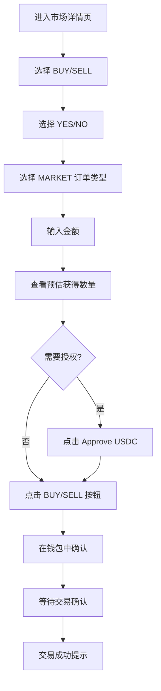
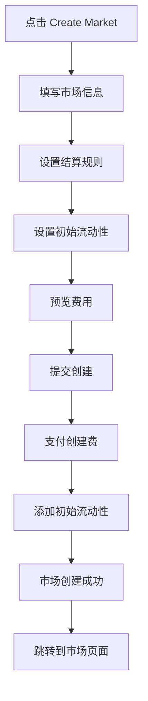
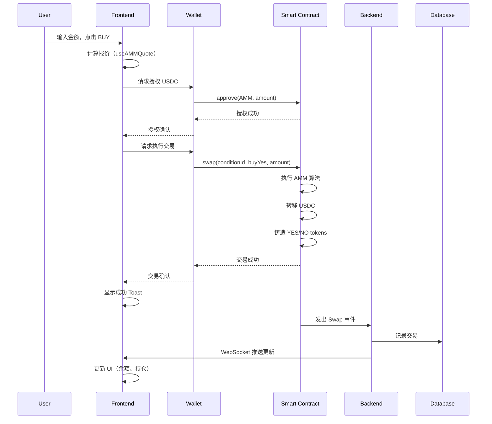
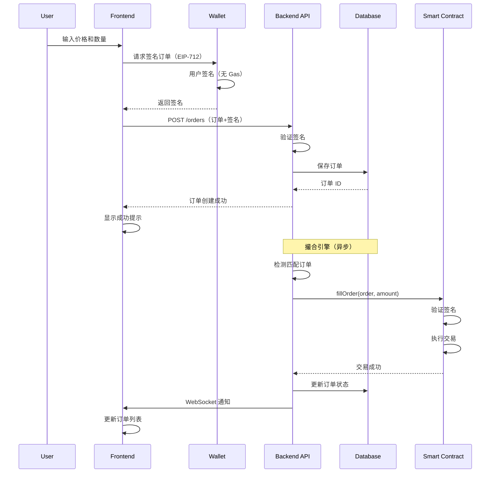
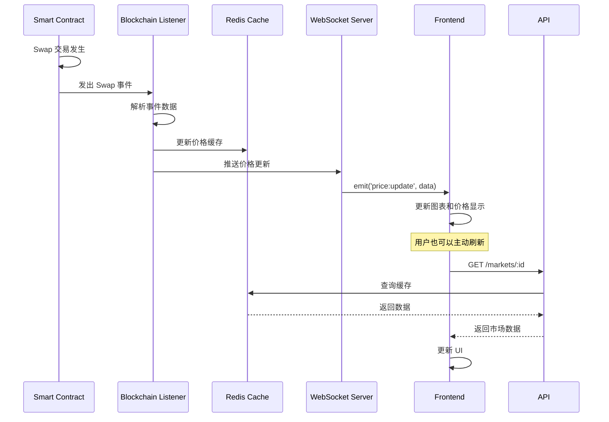
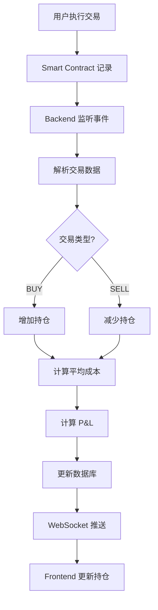
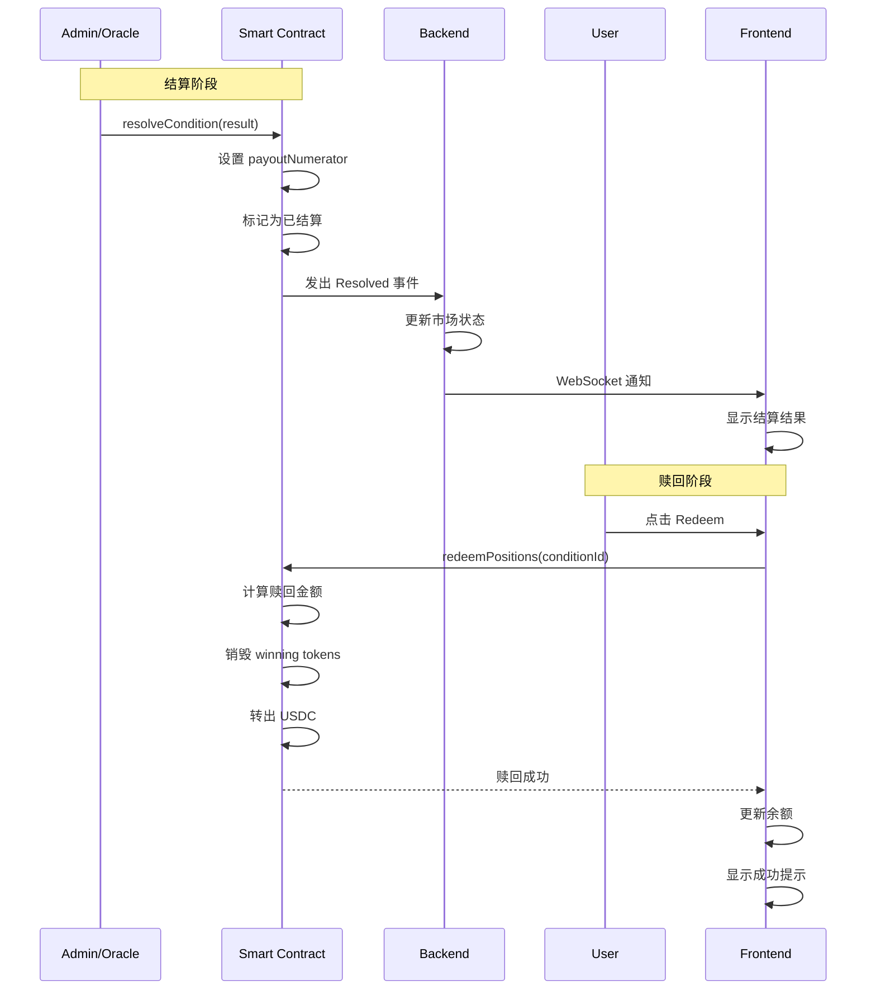

# Polymarket BSC - 完整使用说明文档

## 📖 目录

1. [快速开始](#1-快速开始)
2. [钱包连接](#2-钱包连接)
3. [浏览市场](#3-浏览市场)
4. [交易操作](#4-交易操作)
5. [创建市场](#5-创建市场)
6. [用户中心](#6-用户中心)
7. [高级功能](#7-高级功能)
8. [数据流转流程](#8-数据流转流程)
9. [常见问题](#9-常见问题)

---

## 1. 快速开始

### 1.1 环境要求

**用户端：**
- ✅ 支持的浏览器：Chrome、Firefox、Brave、Edge（最新版本）
- ✅ 已安装 MetaMask 或其他 Web3 钱包
- ✅ BSC 网络配置
- ✅ 至少 10 USDC（用于测试交易）

**网络配置：**
```
网络名称：BSC Mainnet
RPC URL：https://bsc-dataseed.binance.org/
链 ID：56
符号：BNB
区块浏览器：https://bscscan.com
```

### 1.2 第一次使用流程


**步骤：**
1. 访问 `https://polymarket-bsc.com`
2. 点击右上角 "Connect Wallet"
3. 选择 MetaMask（或其他钱包）
4. 确认连接请求
5. 如果不在 BSC 网络，会提示切换
6. 开始浏览和交易！

---

## 2. 钱包连接

### 2.1 连接钱包

**桌面端：**
1. 点击右上角 "Connect Wallet" 按钮
2. 在弹出窗口中选择钱包类型：
   - MetaMask
   - WalletConnect
   - Trust Wallet
   - Coinbase Wallet
   - 其他
3. 在钱包中确认连接
4. 连接成功后显示地址（缩略格式）

**移动端：**
1. 点击汉堡菜单 ☰
2. 点击 "Connect Wallet"
3. 选择钱包或扫描二维码（WalletConnect）
4. 确认连接

### 2.2 网络切换

**自动切换：**
- 如果检测到错误的网络，会自动弹出提示
- 点击 "Switch Network" 自动切换到 BSC

**手动切换：**
1. 点击钱包地址（已连接状态）
2. 在钱包插件中切换网络
3. 选择 "BSC Mainnet"

### 2.3 断开连接

1. 点击已连接的钱包地址
2. 点击 "Disconnect"
3. 或在 MetaMask 中手动断开

---

## 3. 浏览市场

### 3.1 首页浏览

**首页布局：**
```
┌─────────────────────────────────────┐
│  Hero Section（平台介绍）            │
├─────────────────────────────────────┤
│  Platform Stats（统计数据）          │
│  - 总交易量                          │
│  - 活跃市场                          │
│  - 用户数                            │
├─────────────────────────────────────┤
│  Trending Markets（热门市场）        │
│  ┌──────┐ ┌──────┐ ┌──────┐        │
│  │卡片1 │ │卡片2 │ │卡片3 │        │
│  └──────┘ └──────┘ └──────┘        │
└─────────────────────────────────────┘
```

**市场卡片信息：**
- 📌 市场标题（问题）
- 🏷️ 分类标签
- 💹 YES 价格（绿色）
- 📉 NO 价格（红色）
- 💰 总交易量
- ⏰ 结算倒计时

### 3.2 市场列表页面

**访问路径：** `/markets`

**筛选和排序：**

1. **按分类筛选：**
   ```
   ┌─────────────────────────────────┐
   │ [All] [Sports] [Politics] [Crypto] │
   │ [Entertainment] [Finance] [Tech]    │
   └─────────────────────────────────┘
   ```

2. **排序选项：**
   - 📊 Most Volume（最高交易量）
   - 🔥 Trending（热门）
   - 🆕 Newest（最新创建）
   - ⏰ Ending Soon（即将结算）

3. **搜索市场：**
   - 按 `Ctrl+K` (Mac: `Cmd+K`) 打开快速搜索
   - 输入关键词
   - 实时显示匹配结果
   - 点击跳转到市场详情

### 3.3 市场详情页面

**访问路径：** `/markets/[marketId]`

**页面布局：**

```
┌────────────────────────────────────────────┐
│  Market Header（市场头部）                  │
│  - 标题、分类、描述                         │
│  - 统计数据（交易量、流动性、结算时间）      │
├────────────────────────────────────────────┤
│  Left Column             │  Right Column    │
│  ┌─────────────────┐    │  ┌────────────┐ │
│  │ YES/NO Prices   │    │  │ Trade Form │ │
│  │   (大卡片)      │    │  │            │ │
│  └─────────────────┘    │  │ (交易表单)  │ │
│  ┌─────────────────┐    │  │            │ │
│  │  Price Chart    │    │  └────────────┘ │
│  │  (TradingView)  │    │                 │
│  └─────────────────┘    │                 │
│  ┌─────────────────┐    │                 │
│  │   Order Book    │    │                 │
│  └─────────────────┘    │                 │
│  ┌─────────────────┐    │                 │
│  │ Recent Trades   │    │                 │
│  └─────────────────┘    │                 │
└────────────────────────────────────────────┘
```

---

## 4. 交易操作

### 4.1 市价单交易（AMM）

**适用场景：** 立即成交，不关心精确价格

**操作流程：**



**详细步骤：**

1. **选择交易方向：**
   - `BUY`：购买代币
   - `SELL`：出售代币

2. **选择结果：**
   - `YES`：看涨此结果
   - `NO`：看跌此结果

3. **选择订单类型：**
   - 选择 `Market Order`（市价单）

4. **输入交易金额：**
   ```
   Amount (USDC): [输入框]

   实时显示：
   - Total Cost: 100 USDC
   - You receive: ~142.85 tokens
   - Fee: 0.30 USDC
   ```

5. **授权 USDC（首次需要）：**
   - 如果显示 "Approve USDC for AMM" 按钮
   - 点击按钮
   - 在钱包中确认授权交易
   - 等待授权完成（通常 5-10 秒）

6. **执行交易：**
   - 点击 `BUY YES` 或 `SELL NO` 按钮
   - 在 MetaMask 中确认交易
   - 等待交易确认（15-30 秒）

7. **查看结果：**
   - 成功：绿色 Toast 提示 "Trade executed successfully!"
   - 失败：红色 Toast 提示错误信息
   - 持仓自动更新

**费用说明：**
- **交易费：** 0.3%（自动从交易金额扣除）
- **Gas 费：** 由网络决定（BSC 较低，通常 < $0.10）

### 4.2 限价单交易（Order Book）

**适用场景：** 想要在特定价格成交

**操作流程：**

1. **设置订单参数：**
   - 选择 `Limit Order`
   - 输入目标价格（0-1 之间）
     - 例如：0.65 表示 65% 概率
   - 输入交易数量

2. **预览订单：**
   ```
   Price: 0.65 USDC
   Amount: 100 USDC
   You receive: ~153.85 tokens
   ```

3. **授权 USDC：**
   - 首次需要授权 OrderBook 合约
   - 点击 "Approve USDC for OrderBook"
   - 确认授权

4. **提交订单：**
   - 点击 `BUY YES` 或 `SELL NO`
   - 在钱包中**签名订单**（EIP-712 签名，无 Gas）
   - 订单提交到后端数据库

5. **订单状态：**
   - **ACTIVE：** 等待成交
   - **PARTIAL_FILLED：** 部分成交
   - **FILLED：** 完全成交
   - **CANCELLED：** 已取消

6. **管理订单：**
   - 前往 `/portfolio` - Orders 标签
   - 查看所有挂单
   - 点击 "Cancel" 取消未成交订单

**限价单成交机制：**
```
买单价格 >= 卖单价格 → 自动撮合成交
```

### 4.3 流动性提供

**为什么提供流动性？**
- 赚取交易手续费（0.3% 分成）
- 支持市场深度
- 被动收益

**操作流程：**

1. **进入流动性页面：**（功能在市场详情页）

2. **添加流动性：**
   ```
   输入 USDC 金额：1000 USDC
   系统自动计算：
   - YES tokens to add: 500
   - NO tokens to add: 500
   - LP tokens to receive: 1000
   ```

3. **确认添加：**
   - 授权 USDC（如需要）
   - 点击 "Add Liquidity"
   - 确认交易
   - 获得 LP 代币

4. **移除流动性：**
   - 输入要移除的 LP 代币数量
   - 查看预估获得的 YES/NO 代币
   - 确认移除
   - 获得 YES + NO 代币

5. **查看收益：**
   - LP 代币余额
   - 已赚取的手续费
   - 无常损失（IL）

---

## 5. 创建市场

### 5.1 创建市场流程

**访问路径：** `/create-market`

**前提条件：**
- ✅ 钱包已连接
- ✅ 至少 110 USDC（10 创建费 + 100 最低流动性）

**创建步骤：**



**详细表单：**

1. **基本信息：**
   ```
   Market Question *
   ┌─────────────────────────────────────────────┐
   │ Will Bitcoin reach $100,000 by end of 2024? │
   └─────────────────────────────────────────────┘
   提示：Ask a clear yes/no question
   ```

2. **详细描述：**
   ```
   Description *
   ┌─────────────────────────────────────────────┐
   │ This market will resolve to YES if Bitcoin  │
   │ (BTC/USD) reaches or exceeds $100,000 on   │
   │ any exchange before December 31, 2024...    │
   └─────────────────────────────────────────────┘
   ```

3. **分类选择：**
   ```
   Category *
   [Dropdown: SPORTS ▼]
   - SPORTS
   - POLITICS
   - CRYPTO
   - ENTERTAINMENT
   - FINANCE
   - TECHNOLOGY
   - SCIENCE
   - OTHER
   ```

4. **解决方案来源：**
   ```
   Resolution Source *
   ┌─────────────────────────────────────────────┐
   │ CoinMarketCap, Binance, Coinbase           │
   └─────────────────────────────────────────────┘
   ```

5. **结算时间：**
   ```
   Settlement Date *
   [Date/Time Picker: 2024-12-31 23:59]
   ```

6. **初始流动性：**
   ```
   Initial Liquidity (USDC) *
   [Input: 1000]
   最低：100 USDC
   ```

7. **费用预览：**
   ```
   ┌─────────────────────────────────────┐
   │ Market Summary                      │
   ├─────────────────────────────────────┤
   │ Creation Fee:        10 USDC        │
   │ Initial Liquidity: 1000 USDC        │
   │ ─────────────────────────────────   │
   │ Total Required:    1010 USDC        │
   └─────────────────────────────────────┘
   ```

8. **提交创建：**
   - 点击 "Create Market"
   - 确认 2 笔交易：
     1. 支付创建费（10 USDC）
     2. 添加初始流动性（1000 USDC）
   - 等待确认
   - 自动跳转到新市场页面

### 5.2 市场创建最佳实践

**✅ 好的市场：**
- 问题清晰明确
- 可验证的结果
- 明确的时间范围
- 可靠的数据来源
- 避免主观判断

**❌ 不好的市场：**
- 模糊不清的问题
- 无法验证的结果
- 主观性太强
- 数据来源不可靠

**示例对比：**

| 类型 | 示例 | 评价 |
|------|------|------|
| ✅ 好 | "Will Bitcoin reach $100,000 before Dec 31, 2024?" | 明确、可验证 |
| ❌ 差 | "Will Bitcoin go up a lot?" | 模糊、主观 |
| ✅ 好 | "Will Team A win the Super Bowl 2024?" | 明确事件 |
| ❌ 差 | "Will people like the new movie?" | 主观判断 |

---

## 6. 用户中心

### 6.1 Portfolio 页面

**访问路径：** `/portfolio`

**页面结构：**

```
┌─────────────────────────────────────────────┐
│  Portfolio Header                            │
│  [钱包地址]                    [Export Data] │
├─────────────────────────────────────────────┤
│  Statistics（4 个统计卡片）                  │
│  ┌──────────┐┌──────────┐┌──────────┐┌────┐│
│  │Total     ││Total     ││Total     ││Act.││
│  │Trades    ││Volume    ││P&L       ││Pos.││
│  └──────────┘└──────────┘└──────────┘└────┘│
├─────────────────────────────────────────────┤
│  [Positions] [Orders] [History]              │
├─────────────────────────────────────────────┤
│  Tab Content（动态内容）                     │
│  ...                                         │
└─────────────────────────────────────────────┘
```

### 6.2 Positions（持仓）

**显示内容：**

| Market | YES Balance | NO Balance | Realized P&L |
|--------|-------------|------------|--------------|
| Will BTC... | 150.00 | 0.00 | +$25.50 |
| Team A win? | 0.00 | 200.00 | -$10.00 |

**操作：**
- 点击市场名称 → 跳转到市场详情
- 查看每个持仓的盈亏
- 总 P&L 汇总在顶部

### 6.3 Orders（订单）

**显示内容：**

| Market | Type | Outcome | Price | Size | Filled | Status |
|--------|------|---------|-------|------|--------|--------|
| Will... | LIMIT | YES | 0.65 | 100 | 50 | ACTIVE |
| Team... | LIMIT | NO | 0.35 | 200 | 0 | ACTIVE |

**操作：**
- **取消订单：** 点击 Cancel 按钮
- **查看详情：** 点击市场名称
- **筛选：** 按状态筛选（ACTIVE、FILLED、CANCELLED）

### 6.4 History（交易历史）

**显示内容：**

| Date | Market | Type | Outcome | Price | Size | Total |
|------|--------|------|---------|-------|------|-------|
| 2024-01-05 | Will... | MARKET | YES | 0.70 | 100 | $70.00 |
| 2024-01-04 | Team... | LIMIT | NO | 0.30 | 200 | $60.00 |

**操作：**
- 查看所有历史交易
- 导出数据（见下方）

### 6.5 数据导出

**导出选项：**

1. **Export as CSV：**
   - 适用于 Excel 分析
   - 文件名：`positions-2024-01-07.csv`
   - 包含所有字段

2. **Export as JSON：**
   - 适用于程序处理
   - 文件名：`trades-2024-01-07.json`
   - 结构化数据

3. **Export Summary Report：**
   - 交易总结报告
   - 文件名：`trading-summary-2024-01-07.json`
   - 包含统计数据：
     ```json
     {
       "Total Trades": 150,
       "Total Volume": "$15,234.50",
       "Total Fees": "$45.70",
       "Winning Trades": 95,
       "Losing Trades": 55,
       "Win Rate": "63.33%",
       "Total P&L": "$1,234.56",
       "Active Positions": 12,
       "Generated": "2024-01-07 15:30:00"
     }
     ```

**导出流程：**
1. 点击右上角 "Export Data"
2. 选择导出格式
3. 自动下载文件
4. 文件包含当前标签页的数据

---

## 7. 高级功能

### 7.1 快捷搜索（Ctrl+K）

**触发方式：**
- 键盘：`Ctrl+K` (Windows) 或 `Cmd+K` (Mac)
- 移动端：点击浮动搜索按钮

**功能：**
- 实时搜索市场
- 300ms 防抖优化
- 显示最多 5 个结果
- 显示价格预览
- 快捷操作菜单

**使用步骤：**
1. 按 `Ctrl+K` 打开搜索
2. 输入关键词（如 "Bitcoin"）
3. 查看匹配结果
4. 点击结果跳转
5. 或使用快捷操作：
   - Browse All Markets
   - Create New Market
   - View Portfolio

### 7.2 TradingView 专业图表

**功能特性：**
- 📈 实时价格曲线
- 📊 成交量柱状图
- 🔄 YES/NO 结果切换
- ⏱️ 时间范围选择（1H、24H、7D、30D）
- 十字准线
- 缩放和平移

**操作：**
1. 进入市场详情页
2. 图表自动显示
3. 点击 YES/NO 按钮切换数据
4. 点击时间范围按钮切换周期
5. 鼠标悬停查看详细数据
6. 滚轮缩放，拖动平移

### 7.3 Toast 通知

**通知类型：**
- ✅ **Success（绿色）：** 操作成功
- ❌ **Error（红色）：** 操作失败
- ℹ️ **Info（蓝色）：** 信息提示
- ⚠️ **Warning（黄色）：** 警告信息

**特性：**
- 自动消失（默认 5 秒）
- 可手动关闭
- 堆叠显示（支持多个）
- 平滑动画

**常见通知：**
```
✅ "Trade executed successfully!"
❌ "Insufficient balance"
ℹ️ "Market data updated"
⚠️ "Network congestion detected"
```

### 7.4 移动端响应式

**特性：**
- 📱 完整的移动端支持
- 🍔 汉堡菜单（< 1024px）
- 🖥️ 桌面端导航栏（>= 1024px）
- ✨ 平滑动画
- 📍 Sticky 导航

**移动端优化：**
- 单列布局
- 大按钮（易点击）
- 折叠式菜单
- 优化的表格（可横向滚动）
- 浮动搜索按钮

---

## 8. 数据流转流程

### 8.1 交易数据流

**市价单（AMM）流程：**



**限价单（OrderBook）流程：**



### 8.2 市场数据流

**实时价格更新流程：**



### 8.3 用户持仓流程

**持仓计算和更新：**



**P&L 计算公式：**
```
Realized P&L = (卖出价格 - 平均买入价格) × 卖出数量
Unrealized P&L = (当前价格 - 平均买入价格) × 持有数量
Total P&L = Realized P&L + Unrealized P&L
```

### 8.4 市场结算流程

**结算和赎回流程：**



---

## 9. 常见问题

### 9.1 钱包和网络

**Q: 如何切换到 BSC 网络？**
A:
1. 在 MetaMask 中点击网络下拉菜单
2. 选择 "Add Network"
3. 输入 BSC 网络信息（见 1.1）
4. 或点击我们网站的 "Switch Network" 按钮自动添加

**Q: 为什么需要授权 USDC？**
A:
- 授权允许智能合约代表您转移 USDC
- 这是 ERC20 标准的安全机制
- 只需授权一次，后续交易无需重复
- 您可以随时撤销授权

**Q: Gas 费太高怎么办？**
A:
- BSC 的 Gas 费通常很低（< $0.10）
- 可以在钱包中调整 Gas 价格
- 避免在网络拥堵时交易

### 9.2 交易问题

**Q: 交易失败了怎么办？**
A: 常见原因和解决方案：
1. **余额不足**
   - 检查 USDC 余额
   - 确保有足够的 BNB 支付 Gas

2. **滑点过大**
   - 增加滑点容忍度
   - 减少交易金额
   - 使用限价单

3. **网络拥堵**
   - 稍后重试
   - 增加 Gas 价格

4. **合约错误**
   - 检查市场是否已结算
   - 查看错误消息

**Q: 为什么市价单和限价单价格不同？**
A:
- **市价单（AMM）：**
  - 立即成交
  - 价格由 AMM 池子决定
  - 有滑点

- **限价单（OrderBook）：**
  - 需要等待匹配
  - 自己设定价格
  - 无滑点，但可能不成交

**Q: 如何取消限价单？**
A:
1. 进入 `/portfolio`
2. 点击 "Orders" 标签
3. 找到要取消的订单
4. 点击 "Cancel"
5. 在钱包中确认交易
6. 锁定的资金会立即返还

### 9.3 市场和结算

**Q: 市场如何结算？**
A:
1. 到达结算时间
2. 管理员或预言机提交结果（YES 或 NO）
3. 48 小时争议期
4. 如无争议，最终确认
5. 用户可以赎回获胜代币

**Q: 如果结果有争议怎么办？**
A:
- 在 48 小时争议期内可以提交异议
- 需要质押一定金额
- 社区投票或多签决定
- 错误结果会被纠正

**Q: 如何赎回代币？**
A:
1. 等待市场结算完成
2. 进入市场详情页
3. 点击 "Redeem" 按钮
4. 确认交易
5. USDC 会返回到您的钱包

**示例：**
```
持有 100 YES tokens
市场结算为 YES
赎回获得：100 USDC（1:1 兑换）

持有 100 NO tokens
市场结算为 YES
赎回获得：0 USDC（失败方代币价值归零）
```

### 9.4 费用说明

**各项费用明细：**

| 费用类型 | 金额 | 说明 |
|---------|------|------|
| **交易费（AMM）** | 0.3% | 从交易金额扣除，分配给 LP |
| **交易费（OrderBook）** | Maker: 0.1%<br>Taker: 0.2% | 从成交金额扣除 |
| **市场创建费** | 10 USDC | 一次性费用，防止垃圾市场 |
| **初始流动性** | 最低 100 USDC | 创建市场时提供的流动性 |
| **Gas 费** | ~$0.05-0.10 | 网络费用，由 BSC 网络决定 |
| **提现费** | 0 | 无提现手续费 |

**费用计算示例：**
```
买入 100 USDC 的 YES tokens (AMM)
- 交易金额：100 USDC
- 交易费：0.30 USDC (0.3%)
- Gas 费：0.05 USDC
- 总成本：100.35 USDC
- 获得 YES tokens：约 100 / 当前价格
```

### 9.5 安全提示

**⚠️ 重要安全建议：**

1. **保护私钥**
   - 永远不要分享私钥
   - 使用硬件钱包（Ledger、Trezor）
   - 定期备份助记词

2. **验证交易**
   - 交易前仔细检查金额和地址
   - 确认网络正确（BSC）
   - 检查合约地址

3. **防范钓鱼**
   - 只访问官方网站
   - 检查 URL 是否正确
   - 不要点击可疑链接

4. **理性投资**
   - 不要投资超过承受能力
   - 做好风险管理
   - 多样化投资组合

5. **智能合约风险**
   - 智能合约已审计，但仍有风险
   - 不要投入全部资金
   - 了解合约工作原理

---

## 附录

### A. 键盘快捷键

| 快捷键 | 功能 |
|--------|------|
| `Ctrl+K` / `Cmd+K` | 打开快速搜索 |
| `ESC` | 关闭弹窗/搜索 |
| `↑` `↓` | 搜索结果导航 |
| `Enter` | 选择搜索结果 |

### B. API 端点

**公共 API（无需认证）：**
```
GET  /api/markets              # 获取市场列表
GET  /api/markets/:id          # 获取市场详情
GET  /api/markets/trending     # 热门市场
GET  /api/markets/stats        # 平台统计
GET  /api/orderbook/:id        # 订单簿
GET  /api/trades/:marketId     # 交易历史
```

**用户 API（需要钱包签名）：**
```
GET  /api/users/:address/positions   # 用户持仓
GET  /api/users/:address/orders      # 用户订单
GET  /api/users/:address/trades      # 用户交易
POST /api/orders                     # 创建订单
DELETE /api/orders/:id               # 取消订单
```

### C. 智能合约地址

**BSC Mainnet（待部署）：**
```
ConditionalTokens: 0x...
MarketFactory:     0x...
AMM:              0x...
OrderBook:        0x...
USDC:             0xe9e7CEA3DedcA5984780Bafc599bD69ADd087D56
```

### D. 术语表

| 术语 | 解释 |
|------|------|
| **YES Token** | 表示"是"结果的条件代币 |
| **NO Token** | 表示"否"结果的条件代币 |
| **AMM** | Automated Market Maker，自动做市商 |
| **LP** | Liquidity Provider，流动性提供者 |
| **OrderBook** | 订单簿，限价单交易系统 |
| **Slippage** | 滑点，实际成交价与预期价的差异 |
| **P&L** | Profit and Loss，盈亏 |
| **TVL** | Total Value Locked，总锁仓价值 |
| **Gas** | 网络交易费用 |
| **EIP-712** | 以太坊改进提案，用于结构化数据签名 |

---

**文档版本：** v1.0.0
**最后更新：** 2026-01-07
**支持邮箱：** support@polymarket-bsc.com
**Discord：** discord.gg/polymarket-bsc
