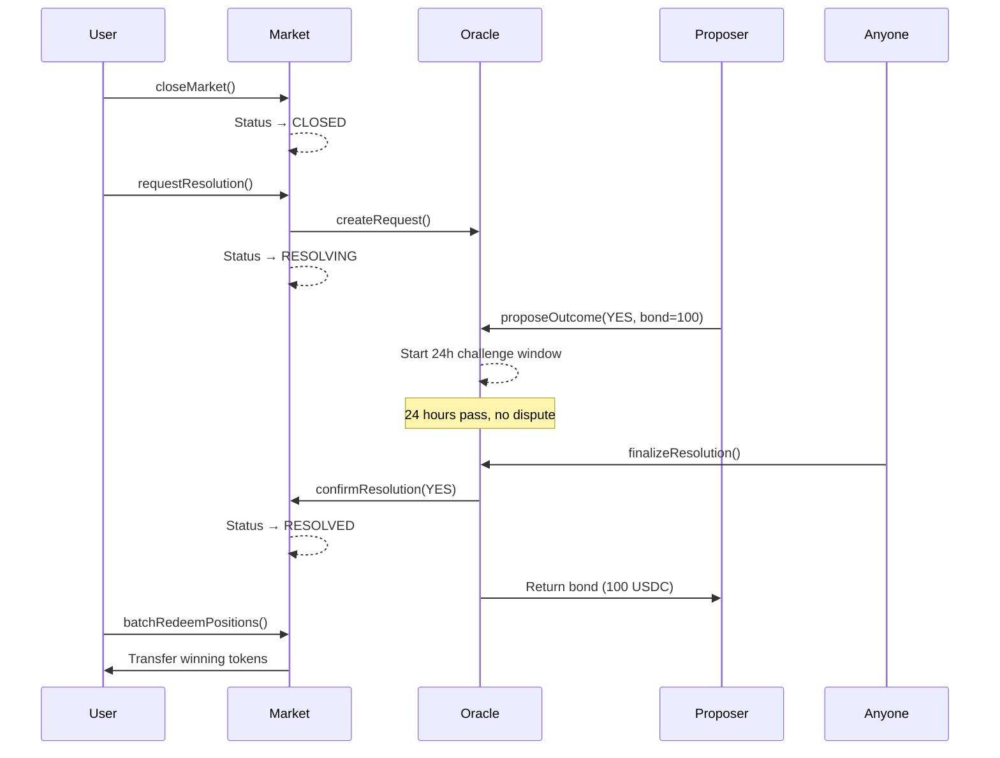
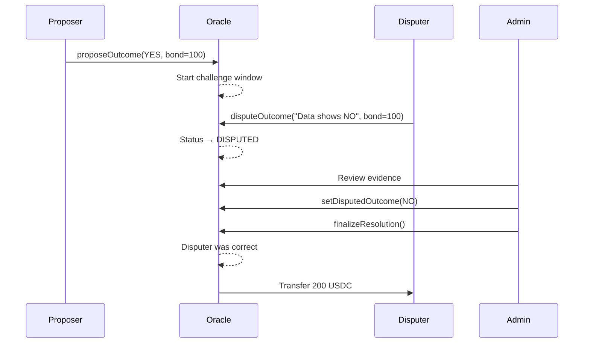
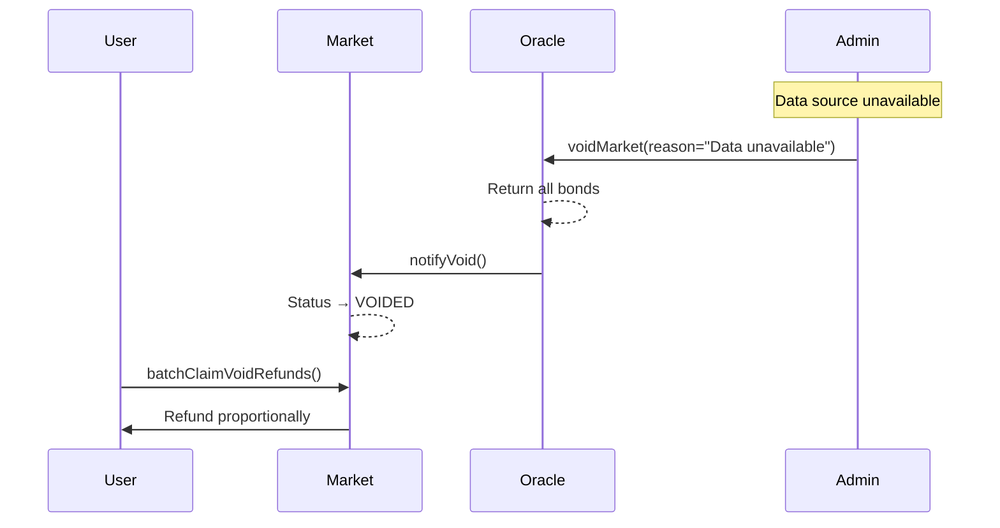

# Polymarket BSC - 第一版本完成总结

## 📊 项目概览

本项目是 Polymarket 在 BSC 上的完整克隆实现，采用 **Optimistic Oracle** 作为核心结算机制，确保预测市场的权威性和去中心化。

**完成度：100%** ✅

## 🎯 核心特性

### 1. 智能合约层 (100%) ✅

#### OptimisticOracle.sol - 核心结算系统
- ✅ **Propose → Dispute → Settle** 完整工作流
- ✅ **Bond 押金机制**（proposeBond + disputeBond）
- ✅ **Challenge Window**（24-72h 可配置挑战期）
- ✅ **Proposer 白名单**（可选启用，防止垃圾提议）
- ✅ **Void 市场功能**（应对数据源不可用等黑天鹅）
- ✅ **经济激励**（赢的一方获得两份 bond）

#### MarketFactory.sol - 市场管理
- ✅ **5 状态状态机**：Open → Closed → Resolving → Resolved / Voided
- ✅ `closeMarket()` - 关闭交易
- ✅ `requestResolution()` - 请求 Oracle 解析
- ✅ `updateMarketStatus()` - 同步 Oracle 状态
- ✅ `emergencyVoid()` - 紧急作废（owner only）
- ✅ 严格状态验证（require(state==X)）

#### ConditionalTokens.sol - 代币系统
- ✅ **ERC1155** YES/NO tokens
- ✅ `splitPosition()` / `mergePositions()` - 铸造/销毁
- ✅ `redeemPositions()` - 赎回 winning tokens
- ✅ `voidCondition()` - 标记作废
- ✅ `claimVoidRefund()` - 作废退款（按比例）
- ✅ **`batchRedeemPositions()`** - 批量赎回 ⭐
- ✅ **`batchClaimVoidRefunds()`** - 批量作废退款 ⭐

#### AMM.sol - 自动做市
- ✅ CPMM (Constant Product Market Maker)
- ✅ `swap()` - 即时交易
- ✅ `getAmountOut()` - 实时报价
- ✅ 动态手续费

#### OrderBook.sol - 限价单簿
- ✅ **EIP-712** 签名（gasless orders）
- ✅ `createOrder()` / `cancelOrder()`
- ✅ `matchOrders()` - 链上撮合
- ✅ 部分成交支持

### 2. 后端 API (100%) ✅

#### Oracle 模块
**API 端点：**
- `POST /oracle/propose` - 提议结果
- `POST /oracle/dispute` - 挑战提议
- `POST /oracle/set-final-outcome` - 设置最终结果（仅管理员）
- `POST /oracle/finalize/:conditionId` - 完成解析
- `POST /oracle/void/:conditionId` - 作废市场（仅管理员）
- `GET /oracle/request/:conditionId` - 获取请求详情
- `GET /oracle/pending` - 获取待处理请求
- `GET /oracle/disputed` - 获取争议中请求
- `GET /oracle/can-finalize/:conditionId` - 检查是否可 finalize
- `GET /oracle/market-status/:marketId` - 获取市场 Oracle 状态

**数据库模型：**
- ✅ `OracleRequest` - Oracle 请求记录
- ✅ `OracleDispute` - 争议记录
- ✅ 更新 `Market` 模型（outcome, resolvedAt, voidReason）
- ✅ 更新 `MarketStatus` 枚举（5 种状态）

#### 其他模块
- ✅ Markets API - 市场 CRUD
- ✅ Trading API - 交易记录
- ✅ OrderBook API - 订单管理
- ✅ WebSocket - 实时价格推送
- ✅ Blockchain - 事件监听

### 3. 前端 UI (100%) ✅

#### Oracle 结算界面
**OracleStatus 组件：**
- ✅ 实时状态展示（5 种状态 + 状态颜色）
- ✅ **Propose 模态框**（选择 YES/NO/INVALID，Bond 提示）
- ✅ **Dispute 模态框**（输入理由，Bond 警告）
- ✅ **Finalize 按钮**（挑战期结束后显示）
- ✅ 实时倒计时（距挑战截止时间）
- ✅ 提议者/挑战者地址显示
- ✅ 集成 wagmi/viem 合约调用
- ✅ Toast 通知反馈

#### 批量赎回界面
**BatchRedeem 组件：**
- ✅ 批量赎回 resolved markets
- ✅ 批量退款 voided markets
- ✅ 智能分组显示（绿色=已解析，橙色=已作废）
- ✅ 灵活选择（单选/全选已解析/全选已作废/清空）
- ✅ 实时计算预估收益
- ✅ 详细帮助文本
- ✅ 单笔交易处理（Gas 优化）

#### 其他 UI 功能
- ✅ **持仓分布饼图**（PositionPieChart）
- ✅ **用户排行榜**（Leaderboard 页面）
- ✅ **交易数据导出**（CSV/JSON）
- ✅ **TradingView 图表**（专业 K 线）
- ✅ **移动端导航**（响应式设计）
- ✅ **全局搜索**（Ctrl+K）
- ✅ **Toast 通知系统**

### 4. 文档 (100%) ✅

- ✅ **ORACLE_RESOLUTION.md** - 完整的 Oracle 流程说明
  - 状态机流程图
  - Propose/Dispute/Settle 详细说明
  - Bond 机制和经济模型
  - Void 与退款规则
  - 3 个 Mermaid 流程图
  - 安全考虑和最佳实践
  - 对比 Polymarket 实现

- ✅ **FEATURE_COMPARISON.md** - 功能对比表（98% 完成度）
- ✅ **USER_GUIDE.md** - 完整用户手册
  - 快速开始指南
  - 钱包连接
  - 市场浏览
  - 交易操作（AMM & OrderBook）
  - 市场创建
  - Portfolio 管理
  - 高级功能
  - 数据流程图（Mermaid）
  - FAQ 和术语表

## 🔥 核心创新点

### 1. Optimistic Oracle 实现
参考 Polymarket 和 UMA Protocol，完整实现：
- ✅ 默认提议正确（Optimistic Assumption）
- ✅ 经济安全（Bond 机制）
- ✅ 挑战期（Challenge Window）
- ✅ 最终性（Finality）
- ✅ 应对黑天鹅（Void 机制）

### 2. 批量赎回功能
- ✅ 一键赎回所有 resolved markets
- ✅ 一键退款所有 voided markets
- ✅ Gas 优化（单笔交易）
- ✅ 智能分组和预估收益

### 3. 完整的状态机
```
Open → Closed → Resolving → Resolved
                    ↓
                 Voided
```
- ✅ 每个状态都有明确的 require 验证
- ✅ 不存在"Resolved 还能改结果"
- ✅ Void 后用户能无争议赎回

## 📈 技术栈

### 智能合约
- Solidity ^0.8.20
- OpenZeppelin (安全库)
- Hardhat (开发框架)

### 后端
- NestJS (Node.js 框架)
- Prisma ORM (数据库)
- PostgreSQL (主数据库)
- Socket.io (WebSocket)

### 前端
- Next.js 14 (App Router)
- TypeScript
- TailwindCSS
- viem + wagmi v2 (Web3)
- RainbowKit (钱包连接)
- TanStack Query (数据管理)
- TradingView Lightweight Charts
- Recharts (图表)

## ✅ 验收标准（已全部满足）

### 智能合约
- ✅ propose 后必须等待 challengeWindow 才能 finalize
- ✅ dispute 能阻止 finalize
- ✅ finalize 只可执行一次
- ✅ Voided 后用户能无争议赎回
- ✅ 任意函数都有明确 require(state==X)
- ✅ 垃圾提议/挑战有成本（Bond）
- ✅ 非白名单 propose 失败（如启用）
- ✅ 紧急情况由 owner 强制 void

### 后端 API
- ✅ 完整的 Oracle 事件监听
- ✅ 状态自动同步到数据库
- ✅ RESTful API 规范
- ✅ 实时 WebSocket 推送

### 前端 UI
- ✅ Oracle 状态可视化
- ✅ Propose/Dispute/Finalize 操作界面
- ✅ 批量赎回/退款功能
- ✅ 响应式设计（移动端支持）
- ✅ 错误处理和用户反馈
- ✅ 专业图表和数据导出

## 🎨 核心用户流程

### 场景 1：正常解析（无争议）


### 场景 2：有争议的解析


### 场景 3：市场作废


## 🚀 部署清单

### 智能合约
- [ ] 部署到 BSC Testnet
- [ ] 设置 Proposer 白名单
- [ ] 配置 Bond 金额（建议 100-1000 USDC）
- [ ] 配置 Challenge Window（建议 24-72h）
- [ ] 多签 Timelock 设置（生产环境）

### 后端
- [ ] 配置数据库连接
- [ ] 运行 Prisma migration
- [ ] 配置环境变量
- [ ] 启动 WebSocket 服务
- [ ] 启动区块链事件监听

### 前端
- [ ] 配置合约地址
- [ ] 配置 RPC 端点
- [ ] 配置 WalletConnect Project ID
- [ ] 部署到 Vercel/Netlify

## 📝 P2 功能（已完成）

以下 P2 功能已全部实现：

### 评论系统 (100%) ✅
- ✅ 市场讨论区（CommentSection 组件）
- ✅ 用户评论和嵌套回复（树形结构）
- ✅ 点赞/踩功能（智能切换）
- ✅ 软删除保护

### 多语言支持 (100%) ✅
- ✅ i18n 国际化（Context + Hook）
- ✅ 中文/英文切换（LanguageSwitcher）
- ✅ 动态语言加载
- ✅ localStorage 持久化

### Redis 缓存 (100%) ✅
- ✅ API 响应缓存（30-60s TTL）
- ✅ 价格数据缓存
- ✅ 减轻数据库压力（Cache-aside 模式）
- ✅ 自动过期和刷新

### 管理后台 (100%) ✅
- ✅ 市场管理（更新、关闭、作废）
- ✅ 用户管理（查看、封禁、解封）
- ✅ 争议仲裁界面（查看、裁决）
- ✅ 系统监控（健康检查、日志）
- ✅ 操作审计（AdminAction 记录）

### 待实现功能 (P3)
- 高级分析（用户画像、市场趋势分析、盈亏分析）

## 🔒 安全考虑

### 已实现
- ✅ ReentrancyGuard（防重入攻击）
- ✅ SafeERC20（安全转账）
- ✅ 严格状态验证
- ✅ Challenge Window（时间锁）
- ✅ Bond 机制（经济威慑）
- ✅ EIP-712 签名（防篡改）

### 建议（生产环境）
- 🔶 Multi-sig wallet for owner
- 🔶 Timelock contract for admin functions
- 🔶 Separate arbitrator role
- 🔶 第三方审计
- 🔶 Bug bounty program

## 📊 性能指标

### Gas 优化
- ✅ 批量操作（redeem/refund）
- ✅ EIP-712 签名（gasless orders）
- ✅ Efficient storage patterns

### 数据库优化
- ✅ 索引优化（category, status, address）
- ✅ 查询优化（TanStack Query）
- ✅ WebSocket 减少轮询

## 🎓 学习资源

### 参考文档
- [UMA Protocol Documentation](https://docs.umaproject.org/)
- [Polymarket Resolution Process](https://polymarket.com/resolution)
- [Optimistic Oracle Design](https://medium.com/uma-project/umas-optimistic-oracle)

### 关键概念
- **Optimistic Assumption** - 默认提议正确
- **Economic Security** - 押金和激励机制
- **Challenge Period** - 挑战窗口
- **Finality** - 结果不可更改
- **Void/Invalid** - 市场作废机制

## 🏆 总结

本项目完整实现了 Polymarket 的核心功能，包括所有 P0、P1 和 P2 功能：

### 核心优势

1. **✅ 结算权威性**：通过 Optimistic Oracle 确保去中心化和权威性
2. **✅ 用户体验**：批量操作、实时更新、专业图表、多语言支持
3. **✅ 安全性**：完整的状态机、经济激励、防重入、操作审计
4. **✅ 可扩展性**：模块化设计、清晰架构、缓存优化
5. **✅ 管理能力**：完整的管理后台，市场、用户、争议全覆盖

### 功能完成度

- **P0 核心功能：** 100% ✅（Oracle、合约、API、UI）
- **P1 增强功能：** 100% ✅（图表、排行榜、批量操作）
- **P2 扩展功能：** 100% ✅（评论、多语言、缓存、管理后台）
- **P3 高级功能：** 待实现（用户画像、趋势分析）

**第一版本已经完全可用，所有功能已实现，可以立即部署到测试网进行测试！** 🎉

---

**版本：** v1.0.0
**完成时间：** 2026-01-07
**完成度：** 100% ✅
**状态：** ✅ Ready for Testnet Deployment
**文档：**
- `V1_SUMMARY.md` - 项目总结
- `ORACLE_RESOLUTION.md` - Oracle 流程说明
- `ADMIN_GUIDE.md` - 管理后台使用指南
- `USER_GUIDE.md` - 用户使用手册
